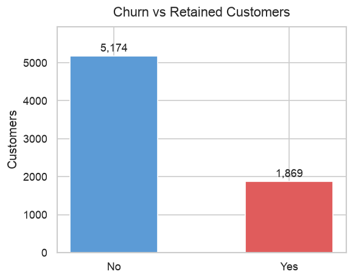
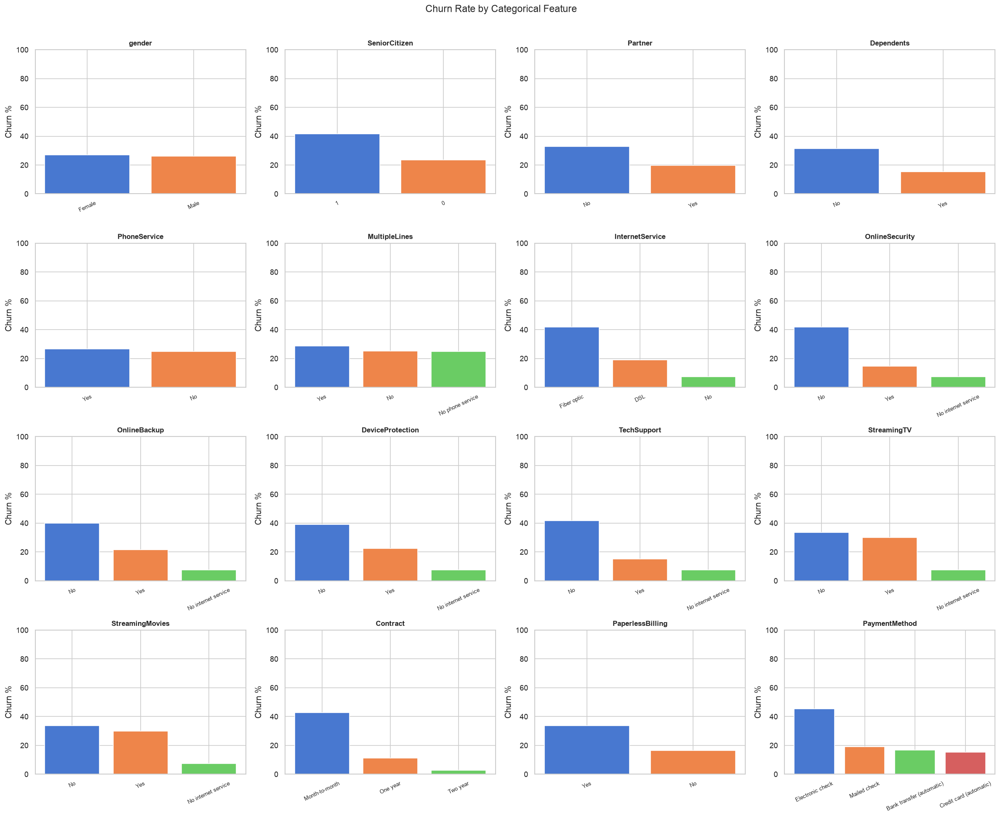
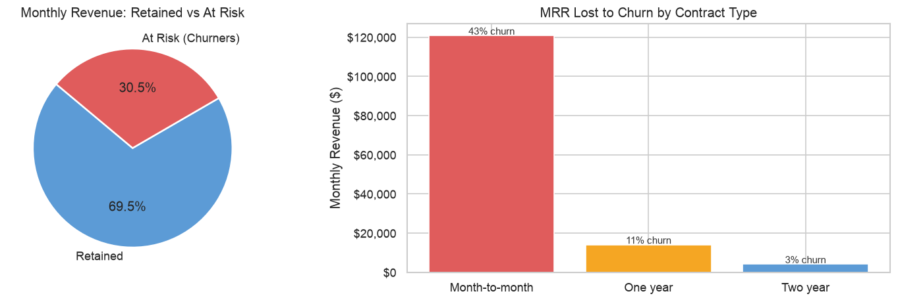
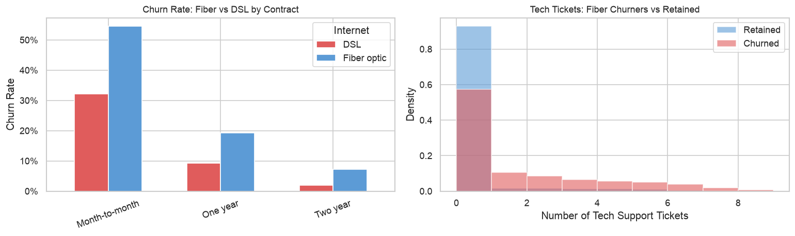
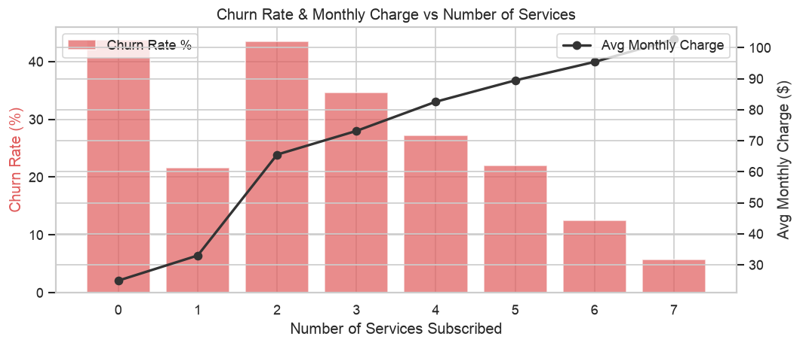
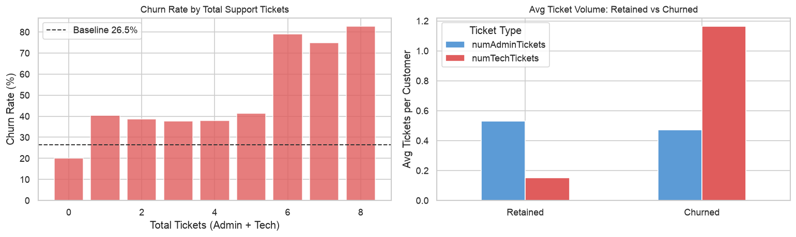
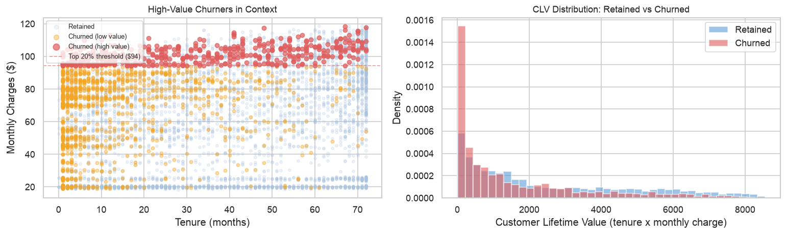
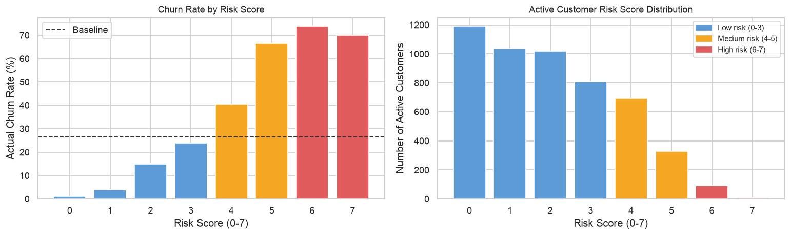

# 📡 Telecom Customer Churn Analysis: A PwC Case Study

## 🎯 Project Overview

- **Objective:** Investigate why customers leave the telecom provider and where the business stands to lose the most revenue, moving beyond a single churn rate to pinpoint which segments, contracts, and service experiences drive attrition.
- **Dataset:** A customer-level file (02 Churn-Dataset.xlsx) covering 7,043 customers and 23 attributes, spanning demographics, account details, subscribed services, support activity, and the churn outcome.
- **Methodology:** Data cleaning and encoding in churn_eda_v2.ipynb, followed by churn distribution analysis across categorical and numerical features, correlation checks, revenue impact quantification, service and support pattern analysis, high-value churner profiling, and a final additive risk score built from seven churn-associated flags.

## 🔍 Key Findings

- **Overall churn rate:** 26.5% across the customer base.

- **Highest churn segments:** customers with less than 12 months tenure (48.3%), month-to-month contracts (42.7%), fiber optic subscribers (41.9%), customers without online security or tech support (around 42%), and senior citizens (41.7%).

- **Revenue concentration:** churners make up 26.5% of customers but 30.5% of monthly recurring revenue, with month-to-month contracts responsible for about $121,000 of the roughly $139,000 in monthly revenue lost to churn.

- **Fiber optic paradox:** fiber customers pay $91.50 a month on average versus $58.10 for DSL, yet churn more than twice as often, with nearly triple the support tickets, pointing to service experience rather than price as the driver.

- **Bundling effect:** churn drops from over 40% among customers with one or two services to under 6% among those with all seven.

- **Support tickets as a signal:** churn jumps from roughly 20 to 40% at up to five tickets to 70 to 83% at six or more.

- **High-value churners:** within the top 20% of customers by monthly charge, 467 have already churned, about a quarter of all churners and roughly $47,000 in lost monthly revenue, and this group is overwhelmingly month-to-month, entirely fiber optic, and largely without tech support.

- **Risk scoring:** a score built from seven churn-associated flags rises from about 1% churn at a score of zero to roughly 74% at a score of six, and applying it to still-active customers flags 423 accounts, worth about $34,000 in monthly recurring revenue, as currently high risk.

## 🚀 Strategies

- **Prioritize contract conversion:** move month-to-month customers onto longer-term contracts through modest discounts or added services in exchange for a one or two year commitment, since contract length is the single largest driver of both churn probability and revenue at risk.
- **Audit fiber optic service quality:** the elevated churn among fiber customers appears tied to support burden rather than price sensitivity, so this deserves a direct look.
- **Treat support tickets as an early warning sign:** intervene proactively once a customer reaches their third ticket, rather than waiting for escalation.
- **Encourage service bundling:** adoption of security, support, and streaming add-ons is a strong retention lever, since more heavily bundled customers churn far less regardless of other factors.
- **Act on the risk list now:** the 423 active customers currently flagged with a risk score of five or higher, representing roughly $34,000 in monthly recurring revenue, should be treated as an immediate, targeted outreach list.
